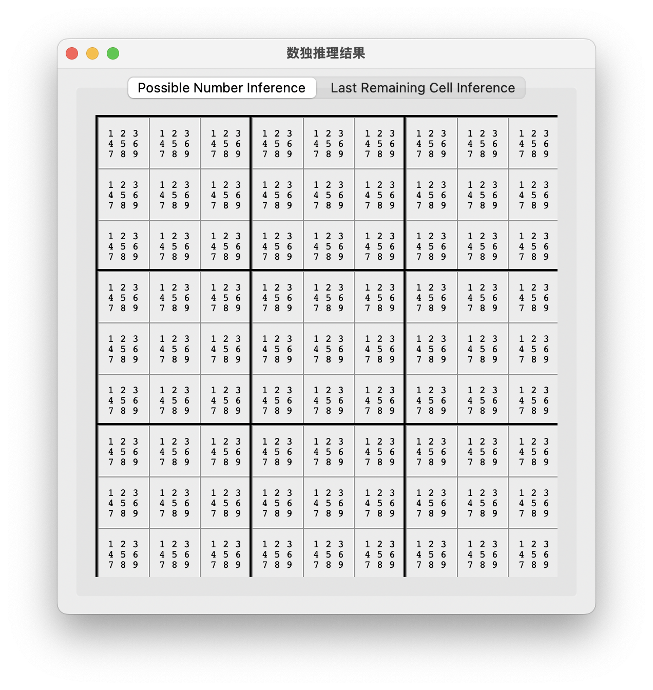
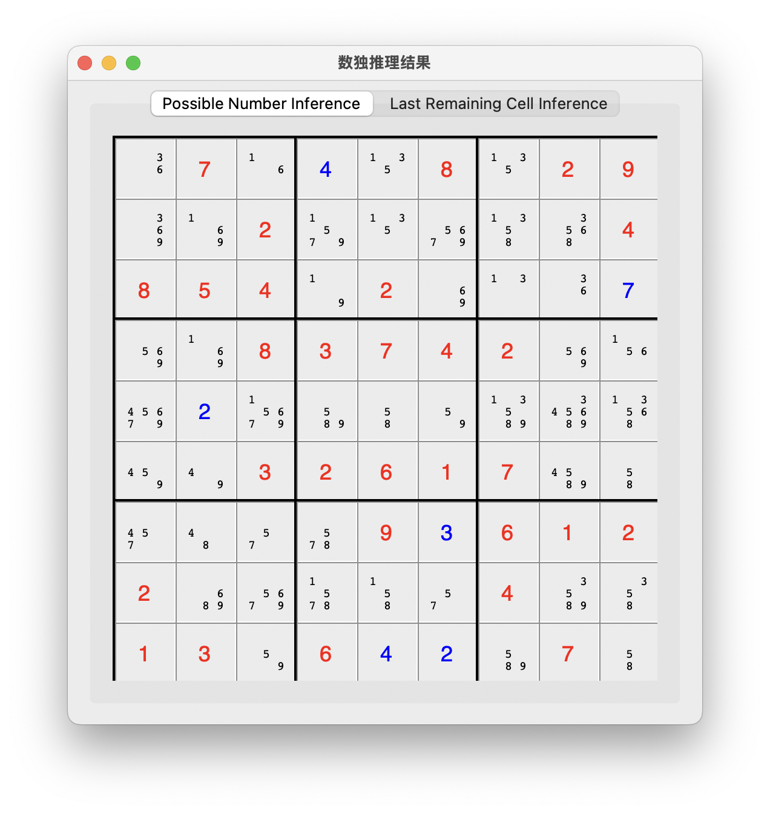
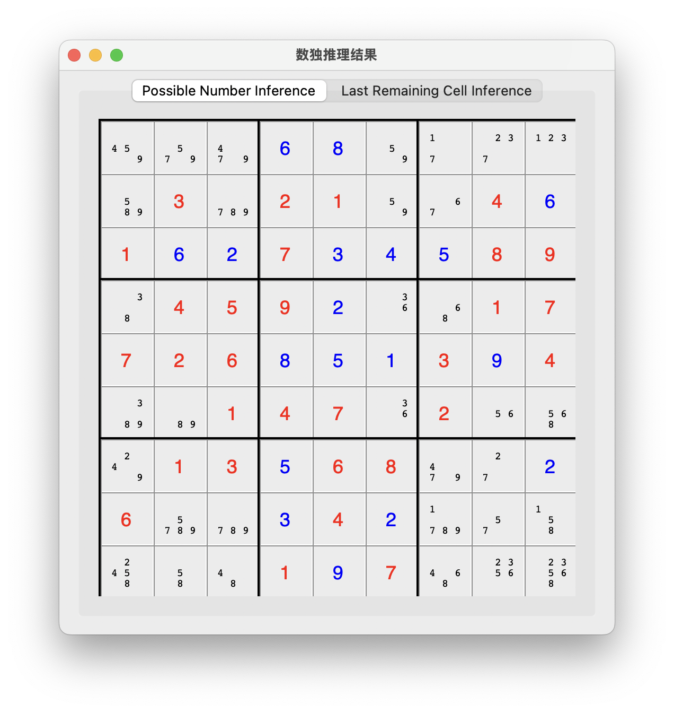

# <center> 从算法到工程

<center> 23336003 陈政宇 </center>

## 1.开发过程描述

见视频及如下表格。

| 任务 | 描述 | 详细开发任务 | 开始时间 |
| ---- | ---- | ------------ | ---- |
| **1. 查阅数独文档** | 阅读并分析数独游戏的规则及现有需求 | - 理解数独数据结构、规则和求解策略、需要实现的功能、涉及到的算法<br>- 确认现有系统模块和接口，明确如何集成新策略      | <br>`00:00` |
| **2. 编写 LastRemainingCell 和 PossibleNumber 函数** | 实现核心策略函数 | - 明确函数输入输出格式<br>- 编写 `PossibleNumber`：扫描指定单元所在行、列、九宫格，计算可能数字<br>- 编写 `LastRemainingCell`：针对某个数字判断可填位置数量，若仅剩一个空格，则填入唯一可能值 | `01:39` |
| **3. 调试函数** | 对独立开发的策略函数进行单元测试与修正 | - 编写测试用例（包括边界情况和特殊情况）<br>- 单独调试 `PossibleNumber` 和 `LastRemainingCell`，确保逻辑正确、错误处理得当 | `04:19` |
| **4. 编写 GUI** | 开发图形界面以供用户交互 | - 实现 `draw_board` 函数，展示数独棋盘<br>- 实现`LastRemainingCell` 和 `PossibleNumber` 求解结果显示在数独棋盘中<br>- 集成调用策略函数更新棋盘 | `12:32` |
| **5. 调试目标函数输出及 GUI** | 集成整体系统并检测交互效果 | - 联合测试策略函数和 GUI 数据交互<br>- 调试确保界面能正确地显示求解结果 | `14:58` |
| **6. 构造测试样例检验正确性** | 制定具体测试用例验证求解准确性 | - 构造简单到复杂的数独测试局面<br>- 手动验证策略函数在各局面中的表现<br>- 记录和分析测试结果，确保覆盖所有边界情况 | `24:25` |
| **7. 编写随机数据测试程序** | 自动生成随机数独局面以便全面测试 | - 开发脚本自动生成随机数独初始局面<br>- 自动调用求解函数，记录日志和输出结果<br>- 分析随机测试结果，识别潜在问题 | `38:37` |
| **8. 大量生成随机数据测试** | 在大规模数据下进行压力测试和鲁棒性验证 | - 批量生成大量随机局面<br>- 统计异常情况<br>- 根据测试进一步优化算法和代码 | `48:37` |

## 2. 函数代码展示

使用了 `python` 实现了两个目标函数，传入参数与返回值与题目要求一致。

### 2.1 LastRemainingCell

```py
def last_remaining_cell_inference(grid):
    """
    利用“唯一候选”原则，从当前已知棋盘及候选值中推断确定值：
    如果在某个区域（行、列、宫格）中，只有唯一的空位可以填入某个候选值，
    则将该候选值确定在该单元格，并更新邻近单元格的候选值。
    
    @param grid: 9x9 数独棋盘，数字 0 表示未填写
    @return: 返回推理使用的候选数组（同时 grid 内的 0 被替换为确定数字）
    """
    candidates = possible_number_inference(grid)
    progress = True
    def update_peers(row, col, num):
        idx = num - 1
        for k in range(9):
            if k != col and grid[row][k] == 0:
                candidates[row][k][idx] = False
            if k != row and grid[k][col] == 0:
                candidates[k][col][idx] = False
        br = (row // 3) * 3
        bc = (col // 3) * 3
        for i in range(br, br+3):
            for j in range(bc, bc+3):
                if (i != row or j != col) and grid[i][j] == 0:
                    candidates[i][j][idx] = False
    while progress:
        progress = False
        # 检查每一行的唯一候选
        for row in range(9):
            for num in range(1, 10):
                count = 0
                pos = None
                for col in range(9):
                    if grid[row][col] == 0 and candidates[row][col][num-1]:
                        count += 1
                        pos = (row, col)
                if count == 1 and pos is not None:
                    i, j = pos
                    grid[i][j] = num
                    for k in range(9):
                        candidates[i][j][k] = (k == num - 1)
                    update_peers(i, j, num)
                    progress = True
        # 检查每一列的唯一候选
        for col in range(9):
            for num in range(1, 10):
                count = 0
                pos = None
                for row in range(9):
                    if grid[row][col] == 0 and candidates[row][col][num-1]:
                        count += 1
                        pos = (row, col)
                if count == 1 and pos is not None:
                    i, j = pos
                    grid[i][j] = num
                    for k in range(9):
                        candidates[i][j][k] = (k == num - 1)
                    update_peers(i, j, num)
                    progress = True
        # 检查每个宫格内的唯一候选
        for br in range(0, 9, 3):
            for bc in range(0, 9, 3):
                for num in range(1, 10):
                    count = 0
                    pos = None
                    for i in range(br, br+3):
                        for j in range(bc, bc+3):
                            if grid[i][j] == 0 and candidates[i][j][num-1]:
                                count += 1
                                pos = (i, j)
                    if count == 1 and pos is not None:
                        i, j = pos
                        grid[i][j] = num
                        for k in range(9):
                            candidates[i][j][k] = (k == num - 1)
                        update_peers(i, j, num)
                        progress = True
    return candidates
```

### 2.2 PossibleNumber

```py
def possible_number_inference(grid):
    """
    根据当前棋盘排除同行、列和宫格中的确定值，
    计算每个未确定单元格的候选值(集)
    
    @param grid: 9x9 数独棋盘，数字 0 表示未填写
    @return: 9x9x9 三维列表，每个内部列表保存候选值状态（索引0表示数字1是否可填）
    """
    candidates = [[[True for _ in range(9)] for _ in range(9)] for _ in range(9)]
    def in_row(row, num):
        for j in range(9):
            if grid[row][j] == num:
                return True
        return False
    def in_col(col, num):
        for i in range(9):
            if grid[i][col] == num:
                return True
        return False
    def in_block(row, col, num):
        br = (row // 3) * 3
        bc = (col // 3) * 3
        for i in range(br, br+3):
            for j in range(bc, bc+3):
                if grid[i][j] == num:
                    return True
        return False
    for i in range(9):
        for j in range(9):
            if grid[i][j] != 0:
                # 已确定的数字：候选数组只保留该数字
                for k in range(9):
                    candidates[i][j][k] = (k == grid[i][j] - 1)
            else:
                for num in range(1, 10):
                    if in_row(i, num) or in_col(j, num) or in_block(i, j, num):
                        candidates[i][j][num-1] = False
    return candidates
```

### 2.3 随机数据测试代码

```py
def is_valid_sudoku(board):
    """
    检查 board 是否符合数独规则。
    board 为 9x9 数独棋盘，0 表示空位，仅检查非 0 数字是否重复。
    """
    # 检查行
    for row in board:
        seen = set()
        for num in row:
            if num != 0:
                if num in seen:
                    return False
                seen.add(num)
    # 检查列
    for col in range(9):
        seen = set()
        for row in range(9):
            num = board[row][col]
            if num != 0:
                if num in seen:
                    return False
                seen.add(num)
    # 检查九宫格
    for block_row in range(3):
        for block_col in range(3):
            seen = set()
            for i in range(block_row*3, block_row*3+3):
                for j in range(block_col*3, block_col*3+3):
                    num = board[i][j]
                    if num != 0:
                        if num in seen:
                            return False
                        seen.add(num)
    return True

import random

def valid_option(board, row, col, num):
    """
    检查在棋盘 board 的 (row, col) 位置填入 num 是否符合数独规则。
    """
    # 检查行
    if any(board[row][j] == num for j in range(9)):
        return False
    # 检查列
    if any(board[i][col] == num for i in range(9)):
        return False
    # 检查九宫格
    br = (row // 3) * 3
    bc = (col // 3) * 3
    for i in range(br, br+3):
        for j in range(bc, bc+3):
            if board[i][j] == num:
                return False
    return True

def generate_random_board(fill_rate=0.3):
    """
    随机生成一个部分填数字的 9x9 数独棋盘。
    fill_rate 决定每个格子有多大概率填充数字（保证生成时不冲突）。
    如果某格随机决定填数字，则从其可能的候选中随机选择一个（若候选为空，则置 0）。
    """
    board = [[0 for _ in range(9)] for _ in range(9)]
    for i in range(9):
        for j in range(9):
            if random.random() < fill_rate:
                options = [num for num in range(1, 10) if valid_option(board, i, j, num)]
                if options:
                    board[i][j] = random.choice(options)
                else:
                    board[i][j] = 0
    return board

def run_random_checker(num_boards=5, fill_rate=0.3):
    """
    生成 num_boards 个随机棋盘，并分别运行 last_remaining_cell_inference
    与 possible_board（由 board_from_candidates 得到）推理，
    最后用 is_valid_sudoku 检查推理后棋盘是否合法。
    """
    import copy
    for idx in range(num_boards):
        print(f"\n【随机测试】 棋盘编号 {idx}")
        board = generate_random_board(fill_rate)
        print("生成随机棋盘:")
        for row in board:
            print(row)
            
        # 1. 使用 last_remaining_cell_inference 进行推理
        board_for_last = copy.deepcopy(board)
        last_remaining_cell_inference(board_for_last)
        print("\n推理后棋盘 (Last Remaining Cell Inference):")
        for row in board_for_last:
            print(row)
        if is_valid_sudoku(board_for_last):
            print("随机测试结果 (Last Inference): 棋盘满足数独规则")
        else:
            print("随机测试结果 (Last Inference): 棋盘违规！")
            
        # 2. 通过 possible_number_inference 得到 tablero (possible_board)
        board_for_possible = copy.deepcopy(board_for_last)
        possible_candidates = possible_number_inference(board_for_possible)
        board_possible = board_from_candidates(possible_candidates)
        print("\n推理后棋盘 (Possible Number Inference):")
        for row in possible_candidates:
            for cell in row:
                row_num = possible_candidates.index(row)
                col_num = row.index(cell)
                if board_for_last[row_num][col_num] != 0:
                    continue
                for num in cell:
                    if num == False:
                        continue
                    num_num = cell.index(num) + 1
                    
                    if valid_option(board_for_possible, row_num, col_num, num_num) == 0:
                        print("候选数字不符合数独规则！")
                        print(f"行：{row_num} 列：{col_num} 候选数字：{num_num}")
                        for num in cell:
                            if num == False:
                                continue
                            num_num = cell.index(num) + 1
                            print(f"候选数字：{num_num}")
                        exit(1)
        if is_valid_sudoku(board_possible):
            print("随机测试结果 (Possible Inference): 棋盘满足数独规则")
        else:
            print("随机测试结果 (Possible Inference): 棋盘违规！")
```

### 2.4 GUI 展示棋盘代码

```py
def draw_possible_board(parent, board, candidates, initial_grid):
    """
    绘制 Possible Number Inference 界面：
    若空白格候选不唯一，则按 3×3 格式显示所有可能数字（调整字号和居中），
    若候选唯一，则显示确定数字（大字号）。
    对于初始时已有的数字（initial_grid 非 0），用特殊颜色标明（例如红色）。
    每个单元格采用固定大小的像素值显示。
    """
    cell_width = 50   # 每个单元格宽 50 像素
    cell_height = 50  # 每个单元格高 50 像素

    for block_row in range(3):
        for block_col in range(3):
            block_frame = tk.Frame(parent, borderwidth=2, relief="solid",
                                   width=cell_width*3, height=cell_height*3)
            block_frame.grid(row=block_row, column=block_col, padx=0, pady=0, sticky="nsew")
            # 防止框架自动调整尺寸
            block_frame.grid_propagate(False)
            for i in range(3):
                for j in range(3):
                    r = block_row * 3 + i
                    c = block_col * 3 + j
                    if initial_grid[r][c] != 0:
                        text = str(initial_grid[r][c])
                        font = ("Helvetica", 18)
                        fg = "red"
                    elif board[r][c] != 0:
                        text = str(board[r][c])
                        font = ("Helvetica", 18)
                        fg = "blue"
                    else:
                        nums = candidates[r][c]
                        line1 = " ".join(str(n+1) if nums[n] else " " for n in range(0,3))
                        line2 = " ".join(str(n+1) if nums[n] else " " for n in range(3,6))
                        line3 = " ".join(str(n+1) if nums[n] else " " for n in range(6,9))
                        text = line1 + "\n" + line2 + "\n" + line3
                        # 使用等宽字体 Courier 保证字符宽度一致
                        font = ("Courier", 10)
                        fg = "black"
                    lbl = tk.Label(block_frame, text=text, font=font, fg=fg,
                                   borderwidth=1, relief="ridge", justify="center", anchor="center")
                    # 使用 place 布局以固定单元格尺寸
                    lbl.place(x=j*cell_width, y=i*cell_height, width=cell_width, height=cell_height)
            for j in range(3):
                block_frame.grid_columnconfigure(j, weight=1)
            for i in range(3):
                block_frame.grid_rowconfigure(i, weight=1)
    for i in range(3):
        parent.grid_rowconfigure(i, minsize=cell_height)
    for j in range(3):
        parent.grid_columnconfigure(j, minsize=cell_width)
```

## 3. 测试效果展示

空棋盘



题目给出样例



部份构造样例

